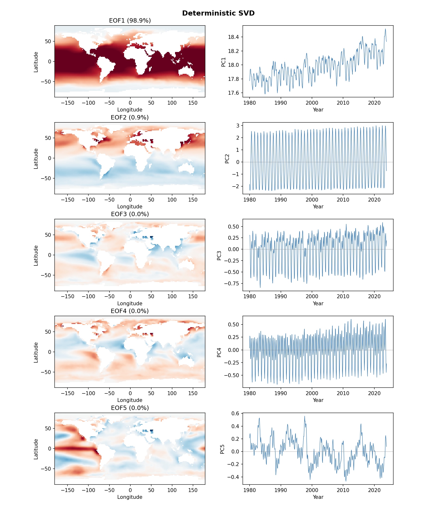

# Climate Analysis Examples

The examples illustrate the use of randomized linear algebra for data sets.  The particular example is EOF/SVD analysis of NOAA Sea Surface Temperature (SST) data. The example was taken from the Tropp, et al. paper mentioned below.  This example is useful for learning about the impact of oversampling and power iterations on the randomized linear algebra performance. 

## References

- [Tropp, Yurtsever, Udell, Cevher. "Streaming Low-Rank Matrix Approximation with an Application to Scientific Simulation." SIAM Journal on Scientific Computing, 2019.](https://epubs.siam.org/doi/abs/10.1137/18M1201068)
- [SketchySVD (IPAM)](https://helper.ipam.ucla.edu/publications/glws3/glws3_15459.pdf)
- [Video Lecture](https://www.youtube.com/watch?v=3P6_zk6FbmE)


## Overview

In order to run the examples in this folder, the data must be downloaded.  The next section explains how to do that.   Once the file is downloaded, the user can run either of the analysis scripts.  The modes that are listed in the *Analysis Scripts* section below are related to the singular vectors of the data matrix in order of their magnitude.  The accuracy of the singular values is directly correlated to the accuracy of the modes.  The user can mimic the experiments illustrated in the JOSS paper by changing the number of extra samples and power iterations used in the randomized SVD.  

## Data

NOAA ERSST v5 monthly SST data (2° resolution, 1980-2023).

Download:
```bash
python download_sst_data.py   # or .m / .jl
```

## Analysis Scripts

### test_sst_modes (Raw SST)

Applies SVD to raw SST values. Dominant modes:

| Mode | Variance | Description |
|------|----------|-------------|
| EOF1 | 98.9% | Mean spatial pattern (warm tropics, cold poles) |
| EOF2-4 | ~1% | Seasonal variations |
| EOF5 | <0.1% | ENSO signal |

## Sign Convention

EOF signs are arbitrary in SVD. We use a reconstruction-based convention:

```
mean(U[:,i]) > 0
```

This ensures:
- Spatial pattern has positive mean over ocean
- Positive PC = positive anomaly contribution
- For trend mode: upward PC = warming

## Mathematical Verification

The temporal signals (PC) plotted correspond exactly to the SVD reconstruction:

```
A_k = Σᵢ₌₁ᵏ σᵢ uᵢ vᵢᵀ
```

Where:
- `uᵢ` = spatial pattern (EOF)
- `vᵢ` = temporal pattern
- `PCᵢ(t) = uᵢᵀ A(:,t) / √n = σᵢ vᵢ(t) / √n`

Each mode reduces the approximation residual:
```
||A - A_k||² = Σᵢ₌ₖ₊₁ σᵢ²
```

## Output

The plots on the right illustrate the different modes.  The routines plot the approximation of these modes generated when using the randomized SVD. The approximate singular values are also plotted. 


*EOF analysis of raw SST showing mean pattern (EOF1) and seasonal cycles (EOF2-4)*


*EOF analysis using randomized SVD (svd_sketch)*

## Languages

Identical implementations in Python, MATLAB, and Julia.
